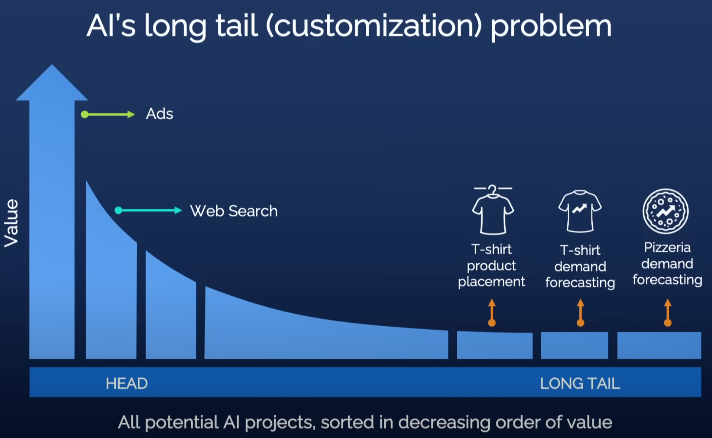
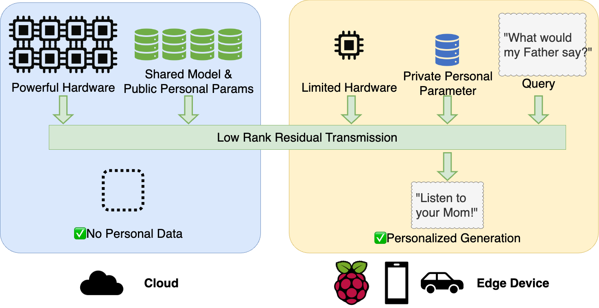
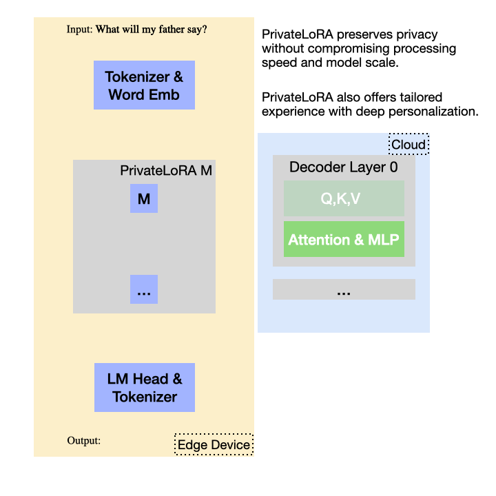
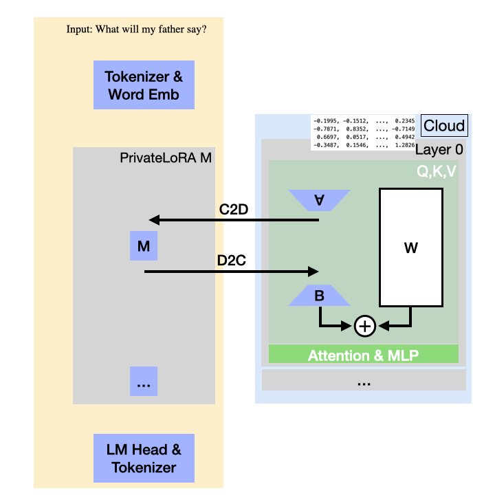
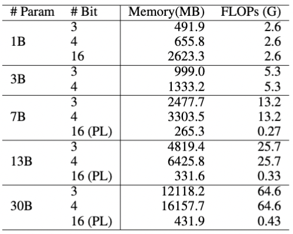
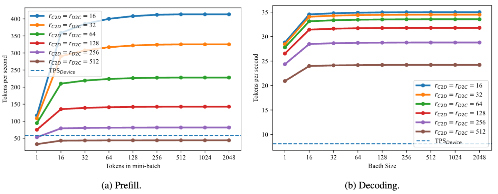
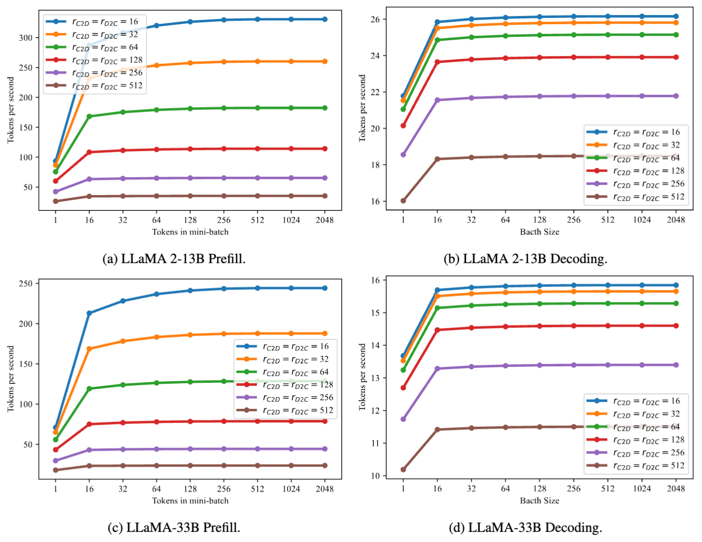
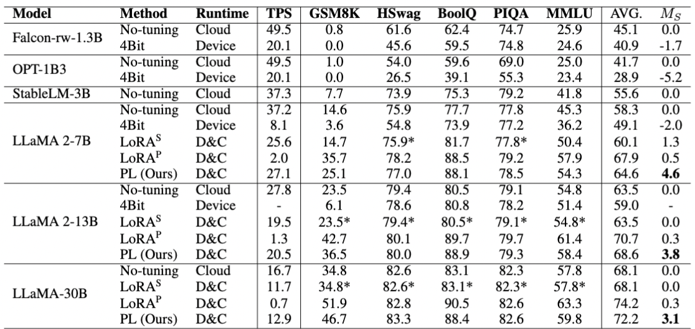
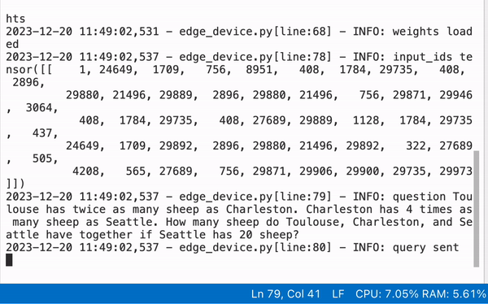

王一鸣，林宇，曾晓东，张冠男

蚂蚁集团

[论文](https://arxiv.org/abs/2311.14030)  [代码](https://github.com/alipay/private_llm) [Demo](https://github.com/alipay/private_llm) [English Version](./privatelora_en.md)

&nbsp;&nbsp;&nbsp;&nbsp;&nbsp;&nbsp;
在吴恩达老师的TED TALK[“AI如何助力任何商业形式”](https://www.youtube.com/watch?v=reUZRyXxUs4)中，几百年前的读书写字被拿来与如今的AI技术进行了类比。
一方面，两者都只有极少数人能接触到：读书写字曾经只属于高僧和祭祀，AI技术则高度集中于大科技公司。
其次，一旦实现普及化，两者都能极大推动人类社会进步。

<figure style="text-align: center;">

<figcaption style="text-align: center;">长尾需求市场规模小，无法支撑昂贵AI系统的构建</figcaption>
</figure>
对21世纪的我们来说，读书与写字的重要性已无需赘述，AI在各种领域也已经创造了极大的价值，以大语言模型为代表的生成式AI更为助力每一个个体提供了可能。
但是大模型背后的云服务能接收和存储完整的用户交互历史，对个人隐私的顾虑让我们使用大模型时心存芥蒂；公共的模型参数不包含个人偏好和私域知识，面对深层次的个人化需求时，我们根本就不考虑用大模型来解决。

<figure style="text-align: center;">

<figcaption style="text-align: center;">PrivateLoRA联动了云计算和边缘设备，提供了私有化模型才有的隐私保护和深度个人化。</figcaption>
</figure>

&nbsp;&nbsp;&nbsp;&nbsp;&nbsp;&nbsp;
面对上述障碍，我们认为实现生成式AI普及的途径是AI模型的私有化，让用户使用AI模型像用自己的手机/汽车一样轻松自然。PrivateLoRA是我们团队针对AI模型私有化的解法，是业界第一个面向大众的AI模型私有化方案。PrivateLoRA把涉及隐私的计算从云上剥离到个人终端，并引入额外模型参数作为个人化的容器。云上的大尺寸模型仅保留主干部分，作为个人终端的拓展，进行隐私无关的中性计算。相比于私有化完整模型，PrivateLoRA只需要私有化不到1%的参数。极低的本地参数量大大降低了硬件门槛，使得PrivateLoRA的私有化成本十分具有竞争力，做到真正面向大众。PrivateLoRA能有效地撬动云上算力，在手机加5G的环境下，能提供接近GPU的速度和质量。因此，PrivateLoRA以极低的用户成本为用户提供了私有化模型才能体验到的隐私性和个人化，能够有效地推动生成式AI普及。

## 一、为什么你还没有自己的大模型

&nbsp;&nbsp;&nbsp;&nbsp;&nbsp;&nbsp;
由于硬件和技术门槛，当前公众使用大语言模型的途径不外乎大公司运行于云上的服务（简称纯云方案）和在个人设备上运行大模型（简称纯端方案）。

&nbsp;&nbsp;&nbsp;&nbsp;&nbsp;&nbsp;
纯云方案凭借云上的强大算力来推动大尺寸模型进行高速高质量的生成。但云计算显然不是人人都能有的，因此纯云方案的私有化没有讨论的必要。
纯端方案提供了私有化的可能，但是消费级产品和云计算存在巨大性能差异，效率和生成质量远不及纯云方案。
因此，个人设备能运行的模型尺寸非常有限，而生成质量与模型尺寸直接成正比，小模型的生成质量能否达到用户的最低期待仍有待时间的检验。
另外，运行模型的能量消耗巨大，长时间拉满芯片功耗并不适合手机和各类边缘设备。

## 二、PrivateLoRA是什么？
&nbsp;&nbsp;&nbsp;&nbsp;&nbsp;&nbsp;
一句话概括，PrivateLoRA通过PEFT方法将涉及隐私的私有计算从云上大模型剥离到个人终端，用个人终端的少量计算撬动云上的公共计算来实现高速、高质量的个人化生成。下面这个动图展示了PrivateLoRA的方案架构和运行原理。

<figure style="text-align: center;">

<figcaption style="text-align: center;">PrivateLoRA不需要高端硬件就能实现大语言模型的私有化，帮你隐私和效率全都要。</figcaption>
</figure>

&nbsp;&nbsp;&nbsp;&nbsp;&nbsp;&nbsp;
PrivateLoRA将公有参数和私有参数分离后，分别部署于云和边缘设备。
云端部署了公共的解码器栈(Decoder Stack)，边缘设备上部署了分词器、WordEmb、LM Head和PEFT参数。
使用模型时，明文数据会先被映射成人类不可读的高维张量，云和边缘设备互相传输激活值来完成模型的前馈/反向传播。
由此，我们可以做到明文数据保留在边缘设备上，杜绝了明文数据在云端泄漏。
私有的PEFT参数会进一步扰动激活值，使模型输出分布与云端基座不同，加强了隐私性的同时也提供了个性化的能力。

> Word Embedding的激活值可以轻松地映射回明文。这个漏洞可以通过将前几层解码层部署在边缘设备来解决。或者我们涉及一种特殊的冷启动协议，使得这些参数的输出对云端可用但是无法映射到明文。为了方便讨论，后文的讨论仍围绕图里的架构。

### 为什么你想要PrivateLoRA？
&nbsp;&nbsp;&nbsp;&nbsp;&nbsp;&nbsp;
与现有的纯端/云的方案相比，PrivateLoRA具有以下优势：
- **数据本地性** 无论是训练还是推理，用户数据和私有参数不出个人设备。相比于纯云方案的明文传输，传输不可读的激活值安全性和隐私性都更强。
- **个人化模型** 个人设备部署的私有参数是隐私信息、私域知识、知识产权等个人化内容的容器，模型更加贴合个人/垂类需求。
- **低成本，高性能** 对于边缘设备的内存、算力和网络带宽要求极低，但是推理速度能达到单卡A100 70%以上，且适配模型越大速度损耗越低。

## 三、为什么PrivateLoRA可行？
&nbsp;&nbsp;&nbsp;&nbsp;&nbsp;&nbsp;
天下没有免费的午餐，PrivateLoRA保护了数据本地性，那么在效率上自然会有折损。接下来，我们就分析技术层面的挑战以及PrivateLoRA的解决方案。

### 激活值的通讯开销

&nbsp;&nbsp;&nbsp;&nbsp;&nbsp;&nbsp;
在这个异构分布式架构中，云端与边缘设备之间存在巨大的算力差异，网络连接也由高速内网降至低速公网，整体计算吞吐率对（1）计算任务分配和（2）网络开销极为敏感。
个人终端上的参数量极低，因此计算量也很少，计算任务分配的问题迎刃而解，但是网络开销的挑战不容小觑。

&nbsp;&nbsp;&nbsp;&nbsp;&nbsp;&nbsp;
网络开销用于云端和边缘设备之间传输激活值以完成模型前馈。对transformer模型而言，激活值的维度为$bs\times seq\_len\times hidden$，其中$bs,seq\_len,hidden$分别代表批大小、序列长度和隐藏维度。三项中前两项取决于用户输入，仅隐藏维度$hidden$与模型结构有关，意味着每token的单位传输量取决于模型的隐藏维度$hidden$。

&nbsp;&nbsp;&nbsp;&nbsp;&nbsp;&nbsp;
然而，隐藏维度$hidden$作为传输基数来说太大了。
以16bit精度的LLaMA 7B为例，其隐藏维度$hidden$为4096，共32层解码器层，因此每token的单位传输量为：
$$4096\times 2\times 32\times 16\sim4.19\text{Mb}.$$

假如序列长度为250个token，通讯总量会迅速膨胀至1Gb。这样的通讯量是无法接受的，因此亟需一种方法来削减通讯的基数。

### 低秩残差传输(Low Rank Residual Transmission)

<figure style="text-align: center;">

<figcaption style="text-align: center;">低秩残差传输降低95%以上的通讯开销。在公网环境的网络延时可以与内网环境不相上下。</figcaption>
</figure>

&nbsp;&nbsp;&nbsp;&nbsp;&nbsp;&nbsp;
为了解决激活值传输开销过大的问题，我们提出了**低秩残差传输(Low Rank Residual Transmission)**。
LoRA等方法证明了在原激活值上加上低秩的残差激活值能很好地适配下游任务上。我们进一步利用残差激活值的低秩特性把激活值的维度缩小，从而减少激活值的通讯开销。

&nbsp;&nbsp;&nbsp;&nbsp;&nbsp;&nbsp;
具体来说，我们把增量权重$\Delta W$分解为
$\Delta W=AMB$，其中$A\in \mathbb{R}^{d\times r_{C2D}}$, $M\in \mathbb{R}^{r_{C2D}\times r_{D2C}}$, $B\in \mathbb{R}^{ r_{D2C}\times k}$。
$r_{C2D}$和$r_{D2C}$是压缩后的矩阵维数，通常都设置成一样的，为了对应云到端（C2D）/端到云（D2C）不对称连接带宽，所以区别标记。
我们把$A,B$部署在云端，$M$部署在边缘设备上就可以将通讯底数从隐藏维度$hidden$降至$r_{C2D},r_{D2C}$。
    
> A,B矩阵在初始化后不进行训练，保持随机，因此不包含个人隐私。

假设$r_{C2D}=r_{D2C}=32$，在低秩残差传输的加持下，通讯量锐减至$32 \times 2\times 32\times 16\sim32.8\text{Kb}$，不到先前$4.19\text{Mb}$的1%。

&nbsp;&nbsp;&nbsp;&nbsp;&nbsp;&nbsp;
此外，$r_{C2D},r_{D2C}$与隐藏维度$hidden$无关，在确定$r_{C2D},r_{D2C}$后，PrivateLoRA的额外开销是固定的。
当我们放大基座模型时，模型自身计算耗时增大，额外开销却不变，使得PrivateLoRA在大尺寸模型上更具有竞争力。

&nbsp;&nbsp;&nbsp;&nbsp;&nbsp;&nbsp;
通讯量的显著降低直接降低了对网络带宽的要求。作为参考，在常见的同构分布式场景（例如用FSDP,DDP,DeepSpeed等训练模型）中，每token的单位传输量与网络带宽的比值约为$\frac{4096}{10e9}$。经过低秩残差传输优化后，单位传输量降低了两到三个数量级（4096 $\rightarrow$ 32），网络带宽的要求可以由数据中心的内网连接降低至5G网络的公网连接。

## 四、手机硬件，GPU速率
&nbsp;&nbsp;&nbsp;&nbsp;&nbsp;&nbsp;
智能手机的普及率和其贴身性使其成为非常理想的大模型私有化载体。
最近，MLC Chat等工作通过极致的优化将LLaMA 2-7B搬到了智能手机上。
但是以目前手机的硬件，生成速度与GPU相差甚远，模型尺寸由于内存限制也被限制在7B左右。另外，运行大模型时，长时间压榨芯片全部算力对手机续航提出巨大挑战。
在笔者的iPhone 13 Pro Max上用MLC Chat跑7B模型，耗电量和发热量巨大，生成一次就会消耗1%的电量。

&nbsp;&nbsp;&nbsp;&nbsp;&nbsp;&nbsp;
PrivateLoRA的设计目标是使用智能手机在日常网络条件下就能达到和A100 GPU相近的生成速度。本身是基于PEFT方法的，即使算上Word Embedding和LM Head，端上的参数量相比纯端方案低得多(不到4%)。低参数量直接降低了内存和处理器压力，使得PrivateLoRA在硬件资源方面极具竞争力。
此外，低秩残差传输砍了95%以上的通讯开销，生成时的吞吐率可以做到和纯GPU相近。接下来，我们就以手机的硬件（iPhone 13 Pro Max）和日常5G网络（端到云60Mbps，云到端100Mbps）对资源和吞吐率进行预估。

### 内存和计算量
&nbsp;&nbsp;&nbsp;&nbsp;&nbsp;&nbsp;
内存限制了手机上能运行的最大模型尺寸，FLOPs影响了运行速度。我们简单的根据参数量$P$预估了内存要求和计算量（$2P$）。
下表列出了不同尺寸模型的内存和FLOPs要求。3bit量化的13B模型需要4GB以上的内存，超过了iOS对于单个APP的内存限制。4bit量化的30B模型需要16GB内存，甚至超过了很多个人电脑的内存容量。
反观PrivateLoRA，16bit精度的30B模型只要431MB，其内存要求也比量化的1B模型都低。

&nbsp;&nbsp;&nbsp;&nbsp;&nbsp;&nbsp;
手机端需要的计算量也比运行完整模型低得多。在7B模型上，前馈1个token的计算量是全尺寸模型的不到2%，在30B模型上计算量不到原来的0.7%。此外，由于端上都是线性模块，不必计算自注意力的Softmax，端上的算力利用率会高很多。

<figure style="text-align: center;">

<figcaption style="text-align: center;">模型所需内存和前馈一个token需要的计算量。标注PL的是指PrivateLoRA</figcaption>
</figure>

### 生成速度预估

&nbsp;&nbsp;&nbsp;&nbsp;&nbsp;&nbsp;
由于绝大部分计算仍是在GPU上，PrivateLoRA的生成速度可以理解为在纯GPU速度的基础上减去网络开销和端上速度的损耗。通过低秩残差传输和端上极少的参数量，网络开销和端上计算得到了极大地减少。接下来我们就对PrivateLoRA造成的速度损耗和最终吞吐率进行量化。

&nbsp;&nbsp;&nbsp;&nbsp;&nbsp;&nbsp;
假设输入数据是$bs$条$seq\_len$长度的序列，通过推导，PrivateLoRA的吞吐率可以写为：

$$TPS=\frac{1}{\frac{1}{TPS^{Decoder}_{C}}+\frac{1}{TPS_0^{PL}}+\frac{1}{TPS^{LM\ Head}_{D}}+t},$$

$$TPS_0^{PL}=\frac{bs \times seq\_len}{T^{PL}_D + T^{PL}_C},$$

其中$TPS^{Decoder}_{C}$是解码器栈在云端的吞吐率，$TPS_0^{PL}$是PrivateLoRA引入参数的计算吞吐率，$TPS^{LM\ Head}_{D}$是LM Head在端上的吞吐率，$t$是前馈1个token所需的通讯时间。
$TPS^{Decoder}_{C}$和$TPS^{LM\ Head}_{D}$可以在GPU和手机上实机测量获得，因此我们仅需要对$TPS_0^{PL}$和$t$进行预估（参考[Transformer Inference Arithmetic](https://kipp.ly/transformer-inference-arithmetic/)）。

&nbsp;&nbsp;&nbsp;&nbsp;&nbsp;&nbsp;
为了展示PrivateLoRA效率上的优越性，我们预估用的硬件参数和网络带宽都很普通。
云端GPU我们以单张A100 80G（1935GBps，312TFLOPS）为基准，手机以笔者的iPhone 13 Pro Max（42.7GBps，18.5FLOPS）为基准，网络带宽为消费者能使用到的5G网络（端到云60Mbps，云到端100Mbps）。

<figure style="text-align: center;">

<figcaption style="text-align: center;">以7B为主干时PrivateLoRA的吞吐率远超纯端方案。 </figcaption>
</figure>

&nbsp;&nbsp;&nbsp;&nbsp;&nbsp;&nbsp;
上图展示了不同$r_{C2D},r_{D2C}$下PrivateLoRA在7B模型推理时的吞吐率tps(token per second)。
作为参考，LLaMA 2-7B在手机上的预填速度54.3tps，解码速度为5.7tps。不论是预填阶段还是解码阶段，PrivateLoRA都远超纯端方案。$r_{C2D}=r_{D2C}=64$时，生成速度能达到27.8tps，为纯端速度的486%，GPU速度(37.1tps)的74.9%。

<figure style="text-align: center;">

<figcaption style="text-align: center;">模型尺寸越大，吞吐率损耗越低。 </figcaption>
</figure>

&nbsp;&nbsp;&nbsp;&nbsp;&nbsp;&nbsp;
由于PrivateLoRA的额外开销与模型隐藏维度$hidden$无关，额外开销在更大尺寸的模型上对最终吞吐率的影响更低。在13B和33B上，PrivateLoRA分别达到了GPU速度的75.9%（21.1tps vs 27.8tps）和79.0%(13.2tps vs 16.7tps)。这意味着使用更大尺寸的主干模型能实现更高的效率。

## 五、强劲适配性能助力深层次个性化

>AMB三个矩阵两个不可训，PrivateLoRA适配性能能行吗？

&nbsp;&nbsp;&nbsp;&nbsp;&nbsp;&nbsp;
作为模型私有化的重要部分，PrivateLoRA支持用户通过微调的方式将个人偏好/隐私数据/知识产权内容等注入端上参数，实现参数层面的个性化。
个性化的优劣与PrivateLoRA对数据拟合能力直接相关。
因此，为了证明PrivateLoRA能很好地支持个性化，我们在常用评测集上微调后进行评测。

&nbsp;&nbsp;&nbsp;&nbsp;&nbsp;&nbsp;
实验的基准选取了能够保护数据本地性的方法，具体包括（1）纯端运行小模型（2）纯端运行量化模型（3）将LoRA按照PrivateLoRA的架构进行分布式。
因为生成速率对用户体验也很重要，我们结合生成速率$TPS$和评测成绩$M$设计了指标$M_S$：
$$M_{S}=\frac{TPS}{TPS_{C}}(M-M_{NT}),$$
其中，$TPS_C$是GPU上的生成速度，$M_{NT}$是没经过微调的评测成绩。
<figure style="text-align: center;">

<figcaption style="text-align: center;">PrivateLoRA在各种评测集上提升了成绩，在不少任务上与LoRA相平。带*星的评测成绩指微调后不如原来。</figcaption>
</figure>

&nbsp;&nbsp;&nbsp;&nbsp;&nbsp;&nbsp;
上面这个表列了各种方法的评测指标，PrivateLoRA既能提供高推理速度，又能提供不错的数据拟合能力。
在许多任务上，PrivateLoRA与原版LoRA的评测成绩十分接近。我们也对PrivateLoRA的其他性质进行了探究，欢迎查看我们的[论文](https://arxiv.org/abs/2311.14030)。

## 六、Code Demo

&nbsp;&nbsp;&nbsp;&nbsp;&nbsp;&nbsp;
我们做了一个简单[demo]()来展示PrivateLoRA的数据拟合能力和推理速度。
demo模拟了用户在个人设备上向模型问了GSM8K中的一道题目，边缘设备联动云端实现了又快又好的生成。

<figure style="text-align: center;">

<figcaption style="text-align: center;">Demo中边缘设备侧只使用cpu进行少量运算就可以使模型变得更“聪明”，生成速率是纯cpu运行的10倍以上。</figcaption>
</figure>

&nbsp;&nbsp;&nbsp;&nbsp;&nbsp;&nbsp;
下面的动图截自demo中边缘设备侧，我们可以看到边缘设备全程仅使用cpu进行计算。虽然边缘设备的参数量很少，但是足以使模型输出正确的解题过程。
demo的运行速度也非常可观。python本身较慢再加上GIL没法并行PrivateLoRA和QKV，双重打击下demo仍达到了3tps的速度，是纯CPU（0.3tps）的10倍。

## 七、总结与展望

&nbsp;&nbsp;&nbsp;&nbsp;&nbsp;&nbsp;
PrivateLoRA极大地降低了终端用户模型私有化的成本，使用一台带5G网络的智能手机就可以享受到私有化大语言模型的隐私性、个性化和高速体验。
在更大的ai应用愿景中，PrivateLoRA只解决了其中一部分问题，还有其他问题值得我们研究。
### 激活值安全

&nbsp;&nbsp;&nbsp;&nbsp;&nbsp;&nbsp;
大语言模型的Word Embedding，解码器栈和LM Head是一同优化得到的，三者需要匹配才能得到一个正常可运行的模型。若在手机上部署原版的Word Embedding和LM Head，在知道解码器栈的情况下，激活值很容易被破解成明文数据，造成隐私泄漏。因此需要一些措施来保护激活值安全。

&nbsp;&nbsp;&nbsp;&nbsp;&nbsp;&nbsp;
在架构层面，我们可以把部分解码器层部署在手机上，只传输不易破解的激活值，把敏感激活值留在手机上。
我们也可以通过一种特殊的冷启动协议来初始化端上参数，使得端上模块的输出对云端解码器可用但是不可破译。
或者我们可以基于微调提出一种冷启动协议。通过在随机获得的数据上微调，对端上参数进行扰动，使其激活值对解码器可用但不可破译。

### 主干变更协议

&nbsp;&nbsp;&nbsp;&nbsp;&nbsp;&nbsp;
由于端上参数与云端参数绑定，当云端模型变更时，端上参数便不再可用。因此，我们需要设计一种主干变更协议保持端上参数与更新后的云端参数适配。这里的矛盾是是否要将新模型的输出对齐旧模型。

### Demo效率提升

&nbsp;&nbsp;&nbsp;&nbsp;&nbsp;&nbsp;
由于Python的语言特性，我们简单搭建的demo无法复现预估的高吞吐率。近期很多AI Infra的工作将transformer的效率提升了若干倍，例如[llama.cpp](https://github.com/ggerganov/llama.cpp)和[MLC Chat](https://github.com/mlc-ai/mlc-llm),我们会在这些工作的基础上实现PrivateLoRA论文中预估的吞吐率。
