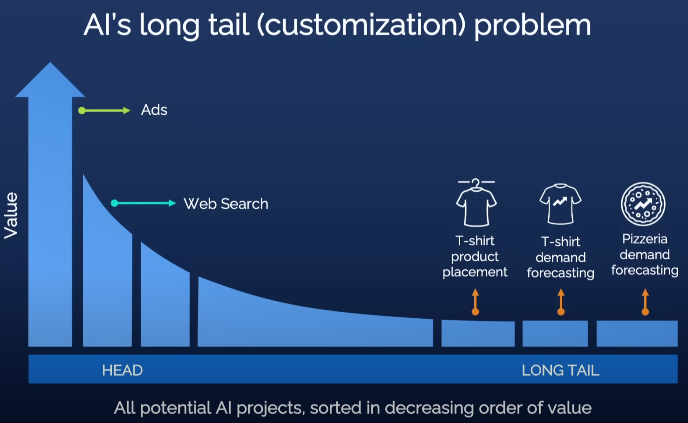
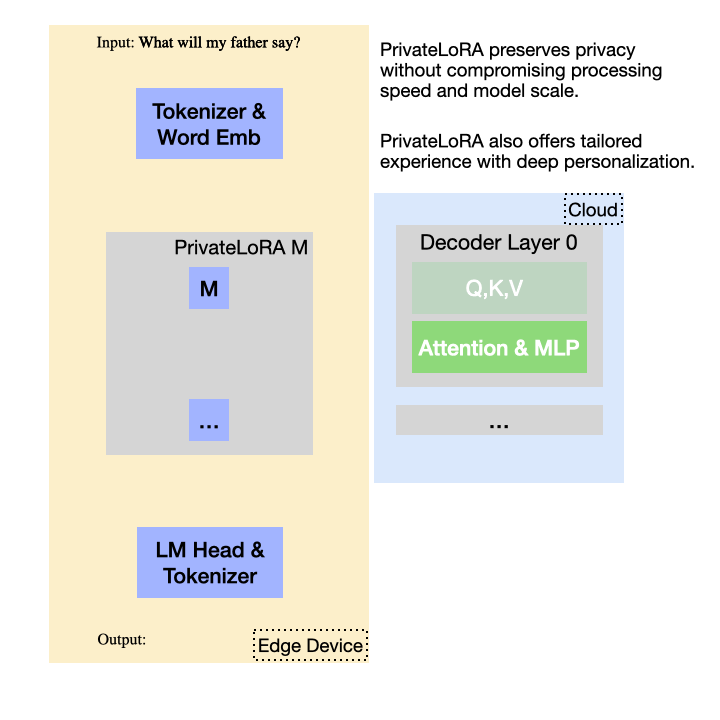
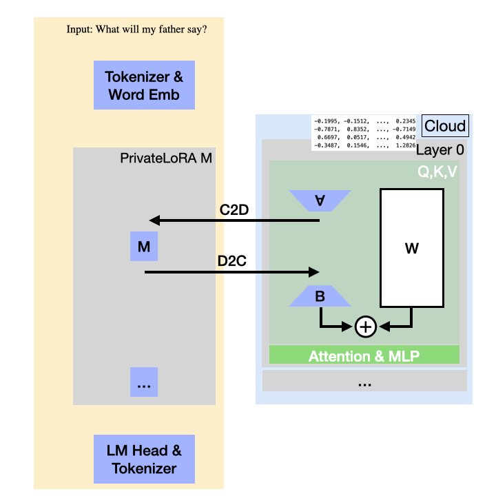
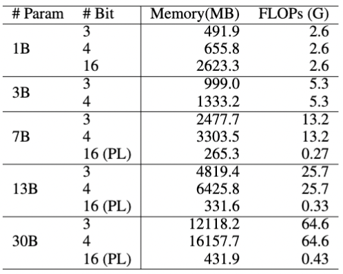
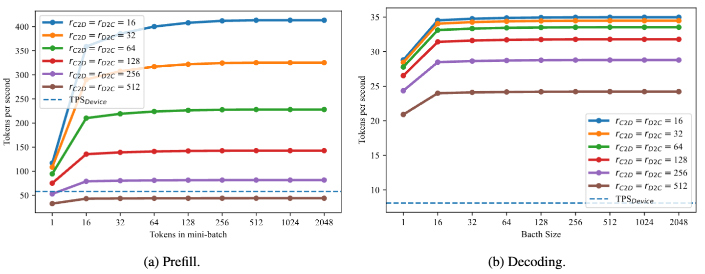
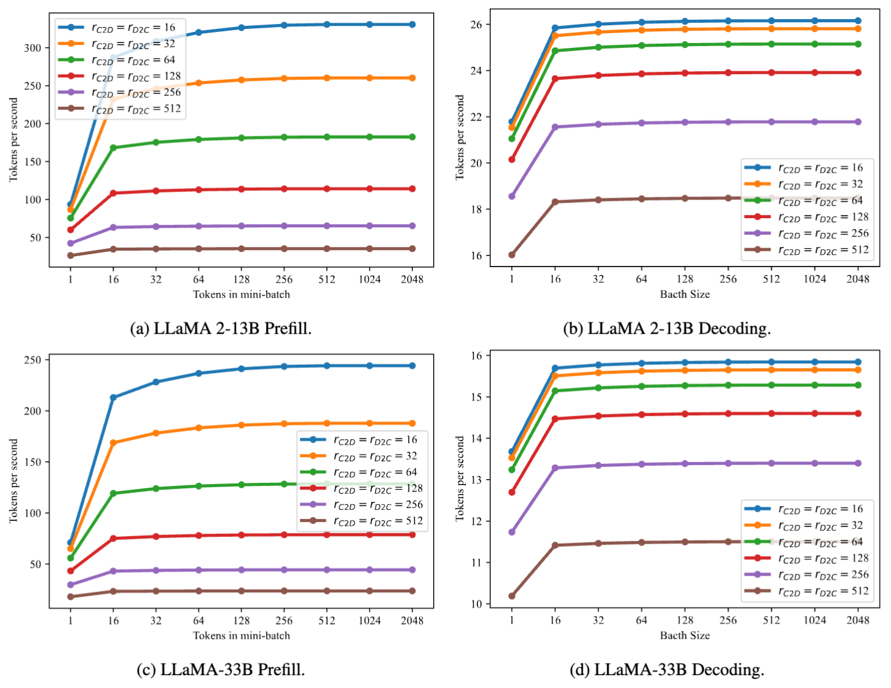
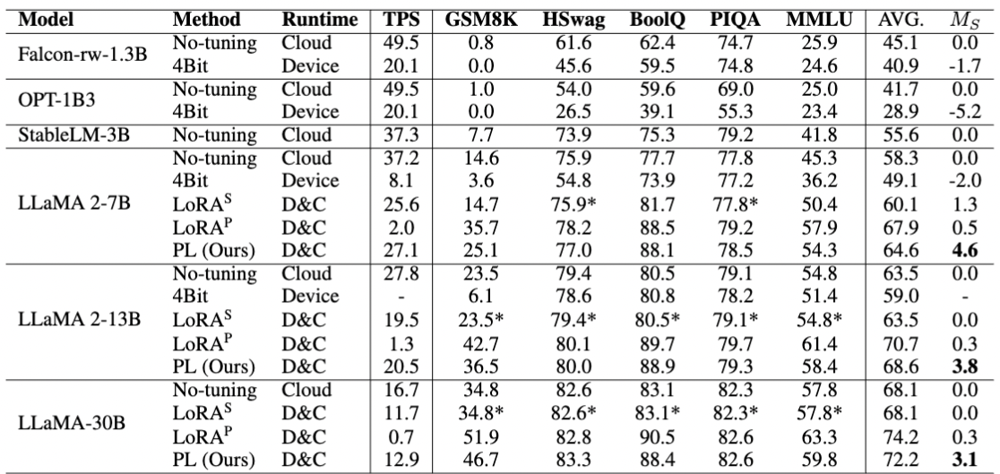

Yiming Wang, Yu Lin, Xiaodong Zeng, Guannan Zhang

[Paper](https://arxiv.org/abs/2311.14030)  [Code](https://github.com/alipay/private_llm) [Demo](https://github.com/alipay/private_llm/tree/main/demo) [中文版本](./privatelora.md)

Andrew Ng's TED Talk, ["How AI Could Empower Any Business"](https://www.youtube.com/watch?v=reUZRyXxUs4), draws a compelling parallel between historical literacy and contemporary AI technology. Initially, both were exclusive realms: literacy was confined to high priests and monks, while AI is predominantly wielded by major tech companies. However, both, once democratized, hold immense potential for societal advancement.

<figure style="text-align: center;">

<figcaption style="text-align: center;">The market size for long-tail demand is too small for expensive AI systems.</figcaption>
</figure>

Today, the benefits of literacy are universally acknowledged, and AI has already demonstrated its value across various sectors. Generative AI, exemplified by large language models, is poised to empower individuals on a grand scale. Yet, concerns linger over privacy, as cloud services hosting these models can store complete user interaction histories. The reluctance to use large models for deeply personalized needs is compounded by the fact that public model parameters lack personal preferences and private knowledge.

<figure style="text-align: center;">

<figcaption style="text-align: center;">PrivateLoRA integrates cloud computing and edge devices, providing privacy protection and deep personalization unique to private models.</figcaption>
</figure>

To push for AI democratization, our team advocates for the privatization of AI models, envisioning a future where using AI is as effortless and careless as using personal smartphones. 
In this blog, we introduce PrivateLoRA, an innovative approach to Generative AI model privatization for the general public.
This solution offloads privacy-sensitive computations from the cloud to personal devices and incorporates personalization in PEFT style.
The large-scale cloud model retains only its backbone, executing neutral computation without infringing on privacy. 
PrivateLoRA's unique approach requires privatizing less than 1% of the total parameters, drastically lowering hardware requirements. 
By harnessing cloud computing, PrivateLoRA achieves performance and quality akin to GPU environments, even on smartphone and 5G networks. 
This solution offers the dual benefits of privacy and personalization at a minimal cost to users, potentially accelerating the democratization of generative AI.

## Why you don't own an AI model yet
The current options for the public to access large language models are primarily through cloud-based services offered by major companies (termed as pure cloud solutions) and running large models on personal devices (termed as pure device solutions).

Pure Cloud Solutions: These utilize the sufficient computational power of cloud servers, enabling fast and high-quality outputs from large models. 
A key concern with cloud solutions is privacy, as user data is transmitted and processed in the cloud, risking exposure of sensitive information.

Pure Edge Solutions: Although they are the definition of model privatization, performance of personal devices does not guarantee acceptable generation quality. The scale of models that personal devices can handle is considerably restricted compared to clusters of GPUs on cloud. Since model size directly influences output quality, it's uncertain whether smaller models can satisfy basic user expectations. 
Furthermore, the substantial energy requirements of running these models present challenges, as constantly running a device at full capacity can lead to battery life issues and overheating risks in smartphones and other edge devices.

## What is PrivateLoRA
PrivateLoRA effectively employs the PEFT method to offload privacy-sensitive computations from large models on cloud to personal devices. This approach uses minimal processing capacity of personal devices to leverage sufficient computations in the cloud, enabling rapid, high-quality personalized content generation. The gif below illustrates the architecture and mechanism of PrivateLoRA.

<figure style="text-align: center;">

<figcaption style="text-align: center;">PrivateLoRA enables the privatization of large language models without the need for high-end hardware, helping you to achieve both privacy and efficiency.</figcaption>
</figure>

Public and private parameters are separately deployed on the cloud and edge devices.The cloud hosts the shared decoder stack, while edge devices are equipped with the tokenizer, WordEmb, LM Head, and PEFT parameters. When using the model, processing of plaintext takes place on the edge device, eliminating the possibility of plaintext data leakage in the cloud.Unreadable activations are transmitted between the cloud and edge devices to complete the model's forward/backward propagation. Private PEFT parameters on edge devices not only serve as personalization containers, they also perturb the activations to enhance privacy.

### Why you want PrivateLoRA
Compared to existing pure edge/cloud solutions, PrivateLoRA has the following advantages:

- **Data Locality**: User data and private model parameters do not leave the personal device and are invisible to the cloud, whether in training or inference. Activation values are arrays of floating-point numbers, which are completely unreadable to humans. Compared to the plaintext transmission of pure cloud solutions, the transmission of activation values offers much higher security and privacy.

- **Personalized Model**: The private parameters deployed on personal devices act as containers for personalized content and also add an extra layer of perturbation to enhance privacy.

- **Low Hardware Requirement but High Performance**: The demands on memory, computing power, and network bandwidth for edge devices are extremely low, even lower than those of pure edge solutions. The inference speed can reach over 70% of a single A100 card, and the larger the model, the lower the speed degradation.

## Why PrivateLoRA works
There's no such thing as a free lunch. While PrivateLoRA protects data locality, it inevitably comes with a compromise in efficiency. 
Let's now dive into the technical challenges and how PrivateLoRA solves them.

### Communication Overhead of Network Activations

In this heterogeneous distributed architecture, there is a substantial disparity in computing power between cloud servers and edge devices. The overall computation throughput is highly sensitive to (1) the allocation of computing tasks and (2) network overhead. The allocation of computing tasks is effortlessly solved after introducing PEFT, but the challenge of network overhead remains significant.

Network overhead is incurred for transmitting activations between the cloud and edge devices to complete the model's forward pass. For transformer models, the dimension of the activations is 
$$bs\times seq\_len\times hidden,$$
where $bs$, $seq\_len$ and $hidden$ represent batch size, sequence length and hidden dimension, respectively. 
Among the three terms, the first two depend on user input, and only $hidden$ is related to the model structure, meaning that the unitary transmission amount per token depends on $hidden$.

However, the hidden dimension is too large as transmission base. Taking the LLaMA 7B model with 16-bit precision as an example, it has a hidden dimension of 4096 and a total of 32 decoder layers. Assuming each layer does one roundtrip between the cloud and the edge device, the transmission amount per token is:
$$
4096 \times 2 \times 32 \times 16 \sim 4.19 \text{ Mb}.
$$
If the sequence length reaches 250 tokens, the communication volume rapidly escalates to 1Gb. This level of communication overhead is impractical, necessitating an immediate solution to minimize it.

### Low Rank Residual Transmission

<figure style="text-align: center;">

<figcaption style="text-align: center;">Low Rank Residual Transmission reduces communication overhead by over 95%. The network latency in a public network environment can be comparable to that in an intranet environment.</figcaption>
</figure>

To address the issue of excessive activation value transmission overhead, we propose **Low Rank Residual Transmission** (LRRT). Methods like LoRA have proven that adding a low-rank residual activations on top of the original activations can well adapt models to downstream tasks. We further exploit the low-rank nature to reduce the dimensionality of the activations, thereby reducing the communication overhead.

Specifically, we decompose the incremental weight $\Delta W$ as
$$
\Delta W = AMB,
$$
where $A \in \mathbb{R}^{d \times r_{C2D}}$, $M \in \mathbb{R}^{r_{C2D} \times r_{D2C}}$, and $B \in \mathbb{R}^{r_{D2C} \times k}$. The dimensions $r_{C2D}$ and $r_{D2C}$ are the compressed activation dimensions, which are typically set to be the same, but here they are distinctly marked to correspond to asymmetric cloud-device connections (Cloud to Device or Device to Cloud).

By deploying $A$ and $B$ on the cloud and $M$ on the edge devices, we can reduce the transmission base from the hidden dimension to a model-irrelevant constant.

> The matrices $A$ and $B$ are not trained after random initialization, thus containing no privacy information and can be deployed on the Cloud.

Assuming $r_{C2D} = r_{D2C} = 32$, with the application of Low Rank Residual Transmission, the communication volume sharply reduces to 
$$32 \times 2 \times 32 \times 16 \sim 32.8\text{Kb},$$
which is less than 1% of the previous $4.19\text{Mb}$.

Furthermore, transmission base is now independent of model architecture. Once $r_{C2D}$ and $r_{D2C}$ fixed, the overhead of PrivateLoRA remains constant regardless of the base model's size. When we scale up the base model, latency of PrivateLoRA is less impactful.

The substantial decrease in communication volume significantly reduces the demand for network bandwidth. In typical homogeneous distributed scenarios (training models with FSDP, DDP, DeepSpeed), the transmission base to network bandwidth ratio is roughly $\frac{4096}{10e9}$. Low Rank Residual Transmission cuts down transmission base by two to three orders of magnitude, thus the bandwidth requirement is tuned down from data center intranet connections to more consumer-accessible 5G connections.

## GPU speed on Smartphones

Smartphones, due to their widespread use and personal connection to users, are increasingly seen as ideal platforms for hosting large, privatized models. Recent developments, such as MLC Chat, have successfully adapted LLaMA 2-7B models to run on smartphones through advanced optimization. However, the performance on current smartphones lags behind that of GPUs in terms of speed, and memory limitations cap model sizes at around 7B. 
Running these large models intensely strains the smartphone's processor, leading to significant battery drain and overheating. 

PrivateLoRA is engineered to match the generation speed of an A100 GPU under the condition of a smartphone and public Internet. 
Utilizing the PEFT method, its architecture significantly reduces parameters on device, total parameters including Word Embedding and LM Head are less than 4% of full model. 
This reduction sharply decreases memory and processor pressure. Also, its low-rank residual transmission slashes over 95% of the communication overhead, enabling comparable generation throughput to GPU. 
Now, we will proceed to calculate the resources and throughput achievable with modest hardware and network conditions.

### Memory and FLOPs requirement
The size of a smartphone's memory limits the largest possible model it can run, while FLOPs determine the execution speed. We can estimate memory requirements and compute the workload, measured as 2P for a model with P parameters. 

<figure style="text-align: center;">

<figcaption style="text-align: center;">The memory required for the model and the computation needed to forward a single token. The annotations with 'PL' refer to PrivateLoRA.
</figcaption>
</figure>

The accompanying table details the memory and FLOPs needed for various model sizes. For instance, a 13B model, when quantized to 3 bits, demands over 4GB of memory, surpassing iOS's limit for a single app. In comparison, a 30B model at 4 bits needs 16GB, exceeding the capacity of many PCs. However, a 30B model using 16-bit precision in PrivateLoRA requires just 431MB, less than a 1B model with quantization in terms of memory.

The computational load on smartphones is significantly reduced compared to running full-sized models. For a 7B model, processing one token requires less than 2% of the full model's computation, and for a 30B model, this drops to under 0.7%. Moreover, since edge modules are linear and don't compute softmax for self-attention, their computational efficiency is notably higher on edge devices.

### Generation Speed Estimation

Given that the majority of computations in PrivateLoRA are performed on the GPU, its generation speed can be estimated by adding latency on top of GPU speed. 
With Low Rank Residual Transmission and minimal parameter count on the edge device, PrivateLoRA produces highly manageable latency. Let's now quantify the speed loss caused by PrivateLoRA and the final throughput rate.

Assuming the input data consists of $bs$ sequences of length $seq\_len$, the throughput of PrivateLoRA can be derived as:
$$
TPS=\frac{1}{\frac{1}{TPS^{Decoder}_{C}} + \frac{1}{TPS_0^{PL}} + \frac{1}{TPS^{LM\ Head}_{D}} + t},
$$
where $TPS^{Decoder}_{C}$ is the throughput of the decoder stack on the cloud, $TPS_0^{PL}=\frac{bs \times seq\_len}{T^{PL}_D + T^{PL}_C}$ is the throughput introduced by the PrivateLoRA parameters, $TPS^{LM\ Head}_{D}$ is the throughput of the LM Head on the edge, and $t$ is the unitary communication time required for forwarding one token.
$TPS^{Decoder}_{C}$ and $TPS^{LM\ Head}_{D}$ can be measured on GPU and mobile devices, so we only need to estimate $TPS_0^{PL}$ and $t$.

To demonstrate the efficiency superiority of PrivateLoRA, we estimate with very ordinary hardware parameters and network bandwidths.
For the cloud GPU, we use a single A100 80G (1935GBps, 312TFLOPS), and for the mobile phone, we use  iPhone 13 Pro Max (42.7GBps, 18.5FLOPS). The network bandwidth is consumer-grade 5G network (60Mbps edge-to-cloud, 100Mbps cloud-to-edge). 
The throughputs $TPS^{Decoder}{C}$ and $TPS^{LM\ Head}{D}$ were measured on the A100 and iPhone 13 Pro Max, respectively, using Huggingface transformers and MLC Chat.

<figure style="text-align: center;">

<figcaption style="text-align: center;">When using a 7B model as the backbone, PrivateLoRA's throughput far exceeds that of a pure edge-based solution. </figcaption>
</figure>

The chart above displays the throughput in terms of tokens per second (tps) for PrivateLoRA inference on a 7B model at different $r_{C2D}$ and $r_{D2C}$ values.

For reference, the LLaMA 2-7B model's prefill speed on a mobile device is 54.3tps, and the decoding speed is 5.7tps. 
On both the prefill and decoding, PrivateLoRA significantly outperforms the pure edge solution. When $r_{C2D} = r_{D2C} = 64$, the generation speed can reach 27.8tps, which is 486% of the pure edge speed, and 74.9% of the GPU speed (37.1tps).

<figure style="text-align: center;">

<figcaption style="text-align: center;">As the size of the model increases, the loss in throughput becomes lower. </figcaption>
</figure>

PrivateLoRA's overhead, being independent of the model's hidden dimension, exerts a less significant impact on throughput in larger-sized models. For instance, with the 13B and 33B models, PrivateLoRA achieved 75.9% (21.1 tps vs 27.8 tps) and 79.0% (13.2 tps vs 16.7 tps) of the GPU's speed, respectively. 

## Adaptation for Deep Personalization

>Triplet structure plus non trainable A,B, how well can PrivateLoRA adapt on downstream tasks?

PrivateLoRA enables users to enhance their experience by integrating personal preferences, private information, and proprietary content into its parameters via fine-tuning. The effectiveness of this customization relies on PrivateLoRA's capacity to adapt to specific data. To validate its proficiency in personalization, we assess PrivateLoRA with several commonly used benchmarks.

Our experimental baselines focus on methods that safeguard data locality. These include: (1) operating a compact model on an edge device, (2) deploying a quantized model on the edge device, and (3) implementing LoRA in a distributed manner as per the PrivateLoRA framework.

Acknowledging the importance of generation speed for user experience, we formulated a metric $M$:
$$
M_{S}=\frac{TPS}{TPS_{C}}(M-M_{NT}),
$$
where $TPS_C$ is the generation speed on the GPU, and $M_{NT}$ is the evaluation score without fine-tuning.

<figure style="text-align: center;">

<figcaption style="text-align: center;">PrivateLoRA has improved scores on various evaluation sets and performs comparably to LoRA on many tasks. Scores marked with an asterisk (*) indicate that the performance after fine-tuning was not as good as the original.</figcaption>
</figure>

The table above lists the evaluation metrics for various methods, showing that PrivateLoRA can provide high inference speed as well as satisfactory data fitting ability.
For many tasks, the evaluation scores of PrivateLoRA are very close to those of the original LoRA. 
We have also explored the scalability and integrity of PrivateLoRA, please refer to our [paper](https://arxiv.org/abs/2311.14030) if you are interested.

## Code Demo
A simple demo was created to showcase PrivateLoRA's data fitting capability and inference speed. The demo simulates a user asking a simple maths question (GSM8K) on a personal device. The edge device collaborates with the cloud to achieve fast and high-quality generation.

<figure style="text-align: center;">

<figcaption style="text-align: center;">The edge device only needs a small amount of CPU computation to make the model "smarter". The overall generation speed is 10 times that of running purely on the CPU.</figcaption>
</figure>

A gif from the demo highlights that the edge device relies solely on its CPU for computation. Despite its small parameter count, the edge device capably steers the model to produce correct and detailed solutions. 
The demo's speed is also notably impressive. 
Despite Python's inherent slowness and the Global Interpreter Lock (GIL) hindering parallel execution, it still achieves a rate of 3 tps. 
This is a significant increase compared to the 0.3 tps achievable with pure CPU.

## Conclusion and Future Work

PrivateLoRA markedly lowers the cost for users to privatize models, allowing them to experience the benefits of privacy, personalization, and high-speed performance of full-scale models using just a smartphone with 5G. However, it addresses only a portion of the broader challenge of democratizing AI, with several other pertinent issues remaining open for research.

**Activation Security**:
In large language models, the interdependence of the Word Embedding, decoder stack and LM Head necessitates their alignment for optimal functionality. Given a known decoder stack, activations can be decrypted into plaintext, potentially compromising privacy. 
Therefore, safeguarding activation security is crucial.

One solution from the architectural perspective is that we deploy several decoder layers on the device to protect vulnerable activations. 
Also ,we can employ a specialized cold-start protocol to ensure the output of edge modules remains effective yet indecipherable to cloud. 

**Backbone Change Protocol**:
The dependency of edge parameters on cloud parameters presents a challenge that updating the cloud model makes edge parameters obsolete, which means end users lose their accumulated personalization altogether.
Therefore, we need Backbone Change Protocol to adapt edge parameters to updated cloud model.
One possible solution can be distilling weight update of decoder stack into low rank matrices and merge them edge parameters.

**Demo Efficiency Optimization**:
Given Python's limitations, our demo falls short of achieving the anticipated high throughput rate. Drawing inspiration from recent advancements in AI infra, we plan to improve our demo throughput based on projects such as llama.cpp and MLC Chat. 
